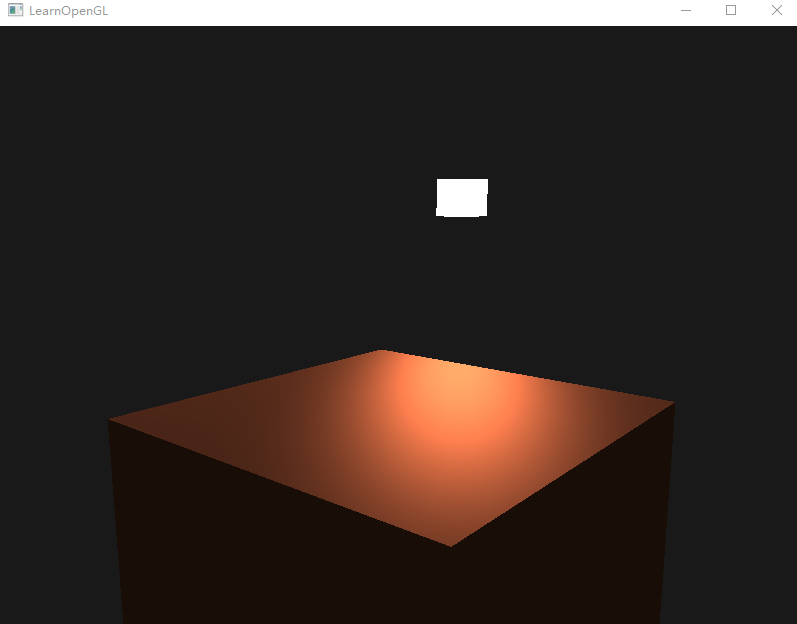

# learning opengl

phong shading

应用简单颜色材质

纹理采样与混合纹理

深度测试与z-fighting artifact

模板测试与物体轮廓

混合与半透明渲染

frame buffer

cubemap

模型渲染与光照模型

<https://github.com/pgeorge1324/gl>

<https://github.com/pgeorge1324/breakOut>
